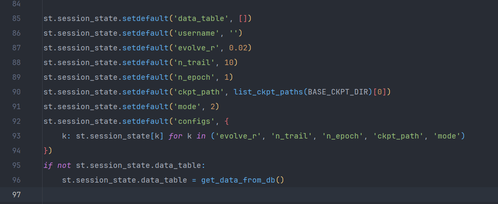
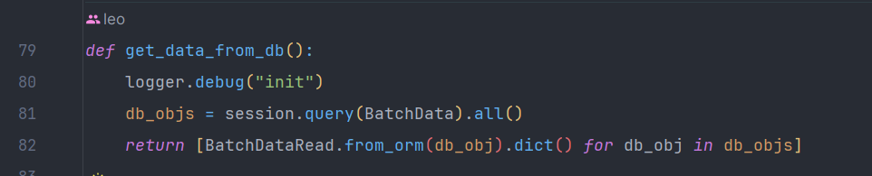
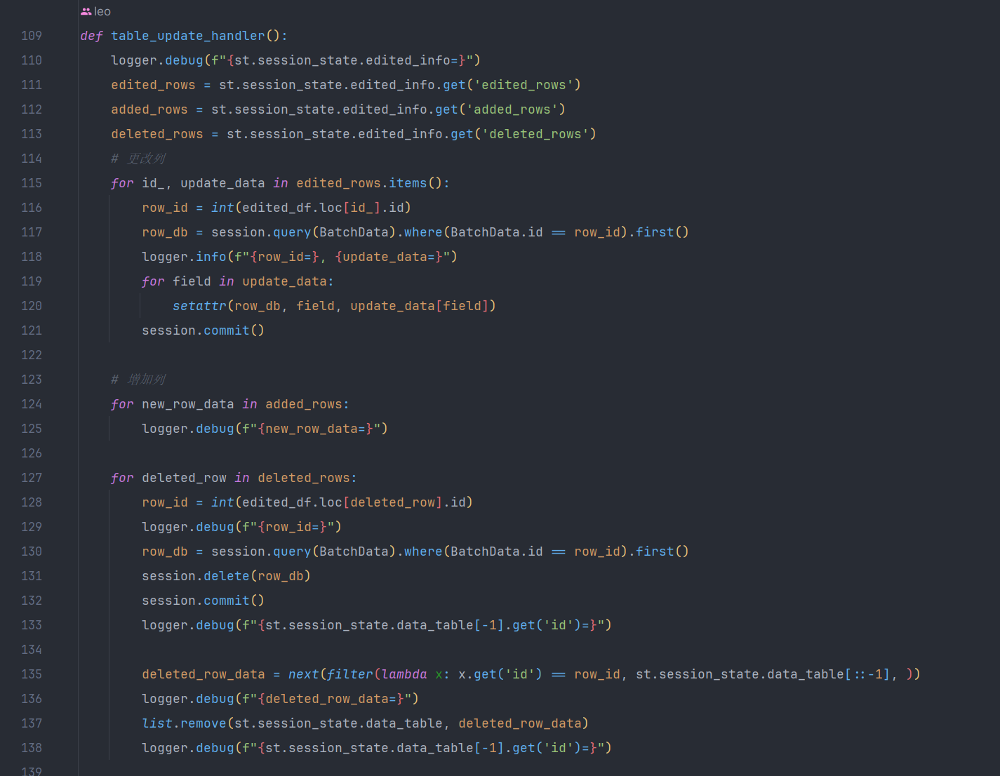
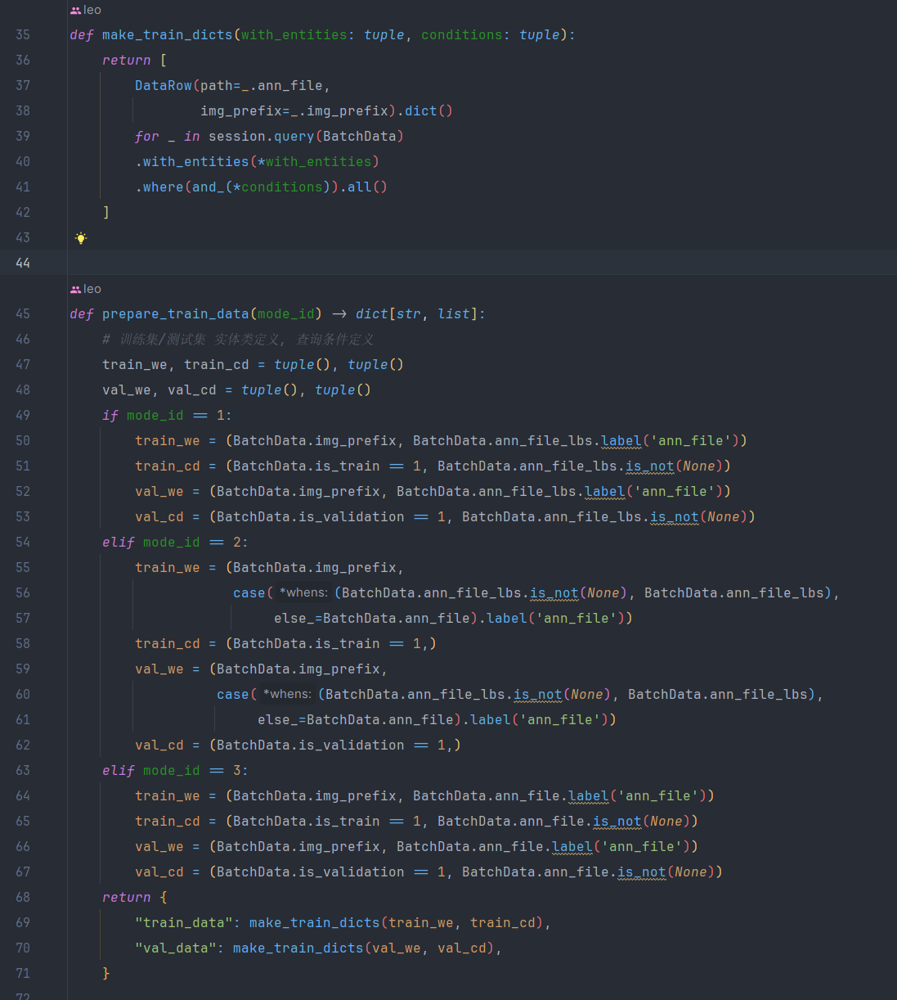
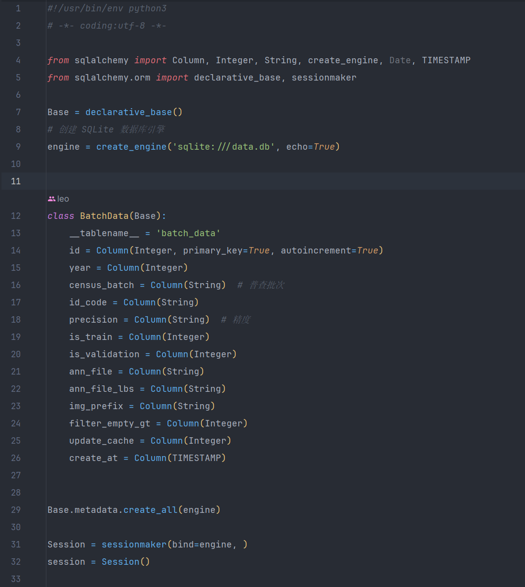
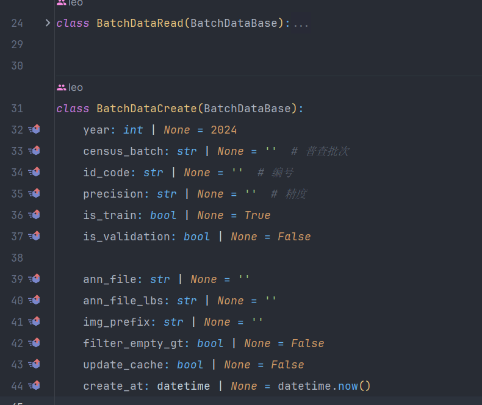

## 技术栈

使用sqlalchemy作为orm框架处理sqlite, pydantic作为数据模型

[pydantic1](https://docs.pydantic.dev/1.10/)

[sqlalchemy2](https://docs.sqlalchemy.org/en/20/intro.html)

[streamlit data_editor](https://docs.streamlit.io/library/advanced-features/dataframes)

[streamlit_sqlite](https://docs.streamlit.io/library/advanced-features/connecting-to-data)

## 实现思路

整体思路是: 保证DataFrame的数据和数据库的数据一致, 避免数据的重复加载
增删查改的操作都是对数据库的操作, 操作数据库后需要保证DataFrame的数据同步更新

1. 初始化变量, 使用st.session_state保存变量

   

2. 数据加载部分, 执行sql语句, 生成数据, 一般页面刷新时执行

   

3. 数据编辑部分, 实际上是对数据库的操作, 操作数据库后需要保证DataFrame的数据同步更新, 这里把操作放到回调函数上, 避免数据频繁更新导致页面闪烁

   

4. 最终数据处理部分, 实际上是按照不同条件生成特定的sql语句, 然后执行sql语句, 生成数据

   

5. 数据库模型定义部分, 将数据表定义成类, 以使用sqlalchemy操作sqlite

   

6. 数据模型定义部分, 主要用户数据创建, 将读取到的数据行转为数据模型类, 也可以快速转为字典

   

