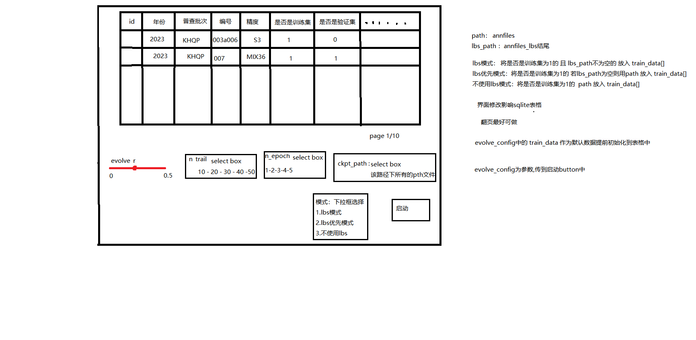
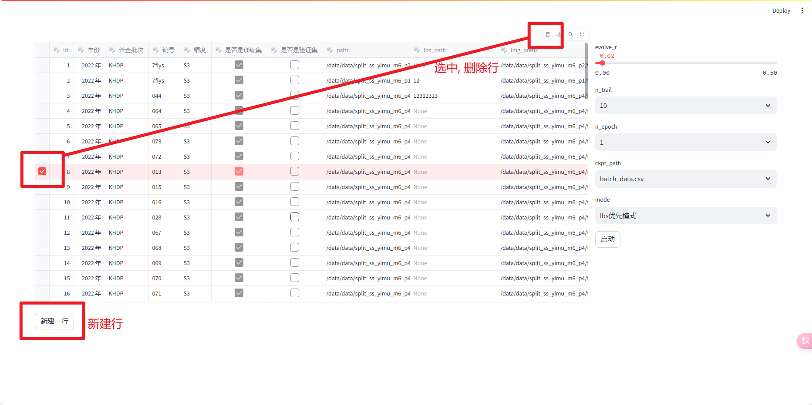

万事胜意:
你可以理解为,现在我上面写的所有train_data都是数据库初始化的值,都是不规则的所以要初始化时就填入,后续在streamlit 新添加的都会默认的把path填好
比如我填2023 KHQP 001 path就能有

万事胜意:
lbs_path 不生成
精度在初始化数据库都给S3

## UI

## reference

[streamlit data_editor](https://docs.streamlit.io/library/advanced-features/dataframes)

[streamlit_sqlite](https://docs.streamlit.io/library/advanced-features/connecting-to-data)

模型训练的启动参数在这个页面配置, 包括训练集, 测试集, 会在这个页面编辑数据
实际使用的数据是那两个path,
后续需要在这个页面补充训练数据或测试数据

每次运行都要把一些数据加载到数据库里,
还是说把这些数据处理到数据库里后, 之后就是对数据库操作了
然后是不是 val_data 也需要放到这个数据库里

lbs模式: select(train==1, path=lbs_path)
lbs优先模式: select(train==1, path=lbs_path if lbs_path else path)
不使用lbs模式: select(train==1, path=path)

